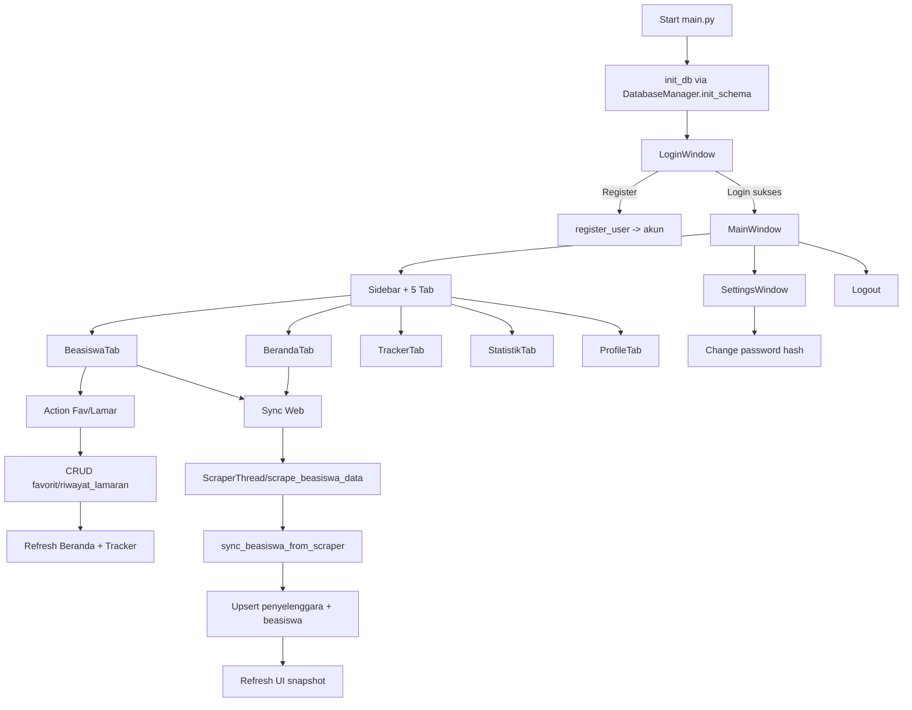
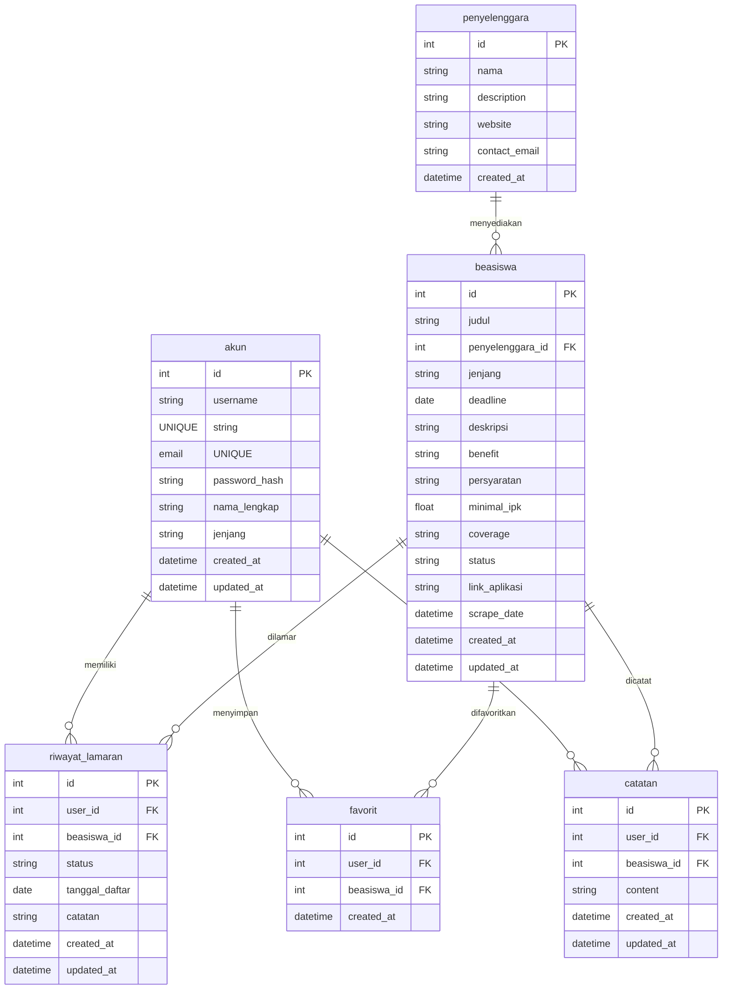
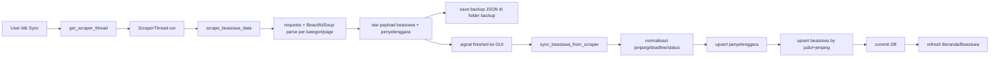

# BeasiswaKu - Dokumen Presentasi Lengkap

Dokumen ini disusun untuk presentasi proyek berdasarkan implementasi aplikasi saat ini.

## 1. Ringkasan Aplikasi Saat Ini

BeasiswaKu adalah aplikasi desktop berbasis PyQt6 untuk membantu pengguna:

- menemukan beasiswa dari data lokal dan hasil scraping,
- menyimpan favorit,
- melacak status lamaran,
- melihat statistik data,
- mengelola profil akun.

Alur utama aplikasi dimulai dari login/register, lalu pengguna masuk ke workspace utama dengan 5 tab aktif:

- Beranda
- Beasiswa
- Tracker Lamaran
- Statistik
- Profil

Catatan penting implementasi saat ini:

- modul backend favorit dan catatan sudah tersedia di CRUD,
- fitur favorit dipakai aktif pada alur Beasiswa -> Beranda,
- file UI legacy seperti tab_favorit.py dan tab_notes.py masih ada di codebase, tetapi tidak menjadi tab utama di MainWindow saat ini.

## 2. Tech Stack

### Bahasa dan Runtime

- Python 3.8+

### UI dan Visualisasi

- PyQt6 (desktop GUI)
- matplotlib (chart pada Tracker dan Statistik)

### Data dan Persistence

- SQLite3 (database lokal file-based)
- sqlite3.Row factory untuk akses data berbasis nama kolom

### Security

- bcrypt untuk hashing dan verifikasi password

### Scraping dan Integrasi Data

- requests (HTTP client)
- beautifulsoup4 + lxml/built-in parser (HTML parsing)
- QThread (scraping async agar UI tetap responsif)

### Testing dan Tooling

- pytest
- Makefile + shell setup script

## 3. Alur Kerja Program (Flow Program)

Diagram high-level eksekusi aplikasi:

## 4. User Flow Lengkap

### 4.1 Autentikasi

1. User membuka aplikasi.
2. Sistem inisialisasi database jika belum ada.
3. User masuk ke LoginWindow.
4. Jika belum punya akun, user register (username, email, password).
5. Password disimpan sebagai bcrypt hash di tabel akun.
6. User login dengan username/email + password.
7. Jika valid, user masuk MainWindow.

### 4.2 Beranda

1. Beranda mengambil snapshot ringkas dari service layer.
2. User melihat:
   - total beasiswa,
   - deadline minggu ini,
   - total lamaran,
   - jumlah diterima,
   - favorit terbaru,
   - aktivitas terbaru.
3. User dapat refresh data.
4. User dapat trigger sync scraping dari web.
5. User dapat klik cepat ke tab Beasiswa/Tracker.

### 4.3 Beasiswa

1. Data beasiswa ditampilkan dalam tabel dengan kolom utama (judul, penyelenggara, jenjang, deadline, status).
2. User dapat search dan filter status/jenjang.
3. User dapat lihat detail beasiswa.
4. User dapat:
   - menambah/menghapus favorit,
   - menambahkan lamaran (status awal Pending).
5. Setelah aksi berhasil, tab terkait di-refresh agar state konsisten.

### 4.4 Tracker Lamaran

1. User melihat daftar lamaran miliknya.
2. User dapat edit status lamaran (Pending/Diterima/Ditolak di level UI).
3. Mapping status disimpan ke DB dalam format backend (contoh Accepted/Rejected).
4. User dapat hapus lamaran.
5. Sistem memperbarui chart proporsi status dan lamaran bulanan.

### 4.5 Statistik

1. Tab Statistik memanggil snapshot agregasi dari database.
2. Sistem menampilkan:
   - total dan status card,
   - chart beasiswa per jenjang,
   - donut status ketersediaan,
   - top 5 penyelenggara.
3. Status dinormalisasi agar label konsisten lintas sumber data.

### 4.6 Profil dan Pengaturan

1. User melihat informasi akun dan ringkasan profil.
2. User dapat membuka Settings.
3. User dapat mengganti password:
   - verifikasi password lama,
   - hash password baru,
   - update di tabel akun.

### 4.7 Logout

1. User klik keluar dari sidebar.
2. Sistem tampilkan konfirmasi logout.
3. Jika setuju, MainWindow ditutup.

## 5. Pembagian Modul dan Struktur Kode

Struktur arsitektur yang dipakai mengikuti pola layered modular.

| Layer | Folder Utama | Tanggung Jawab | Komponen Kunci |
|---|---|---|---|
| Entry/Orchestration | main.py | bootstrap aplikasi, login flow, wiring tab | LoginWindow, RegisterWindow, MainWindow |
| Core Infrastructure | src/core | konfigurasi dan koneksi DB terpusat | config.py, database.py (DatabaseManager singleton) |
| Data Access + Business Rules | src/database | CRUD akun, beasiswa, lamaran, favorit, catatan, agregasi | crud.py |
| Service Layer | src/services | data shaping/snapshot untuk UI dan sinkronisasi scraping | dashboard_service.py, beasiswa_service.py, status_utils.py |
| Presentation Layer | src/gui | komponen visual, tab UI, sidebar, styling | tab_beranda.py, tab_beasiswa.py, tab_tracker.py, tab_statistik.py, tab_profil.py |
| External Data Integration | src/scraper | scraping website sumber dan backup JSON | scraper.py |
| Visualization Support | src/visualization | modul visualisasi tambahan (historical module) | visualisasi.py |

## 6. Bagaimana Data Mengalir Dalam Sistem

### 6.1 Login dan Session User

1. GUI kirim username/password.
2. CRUD ambil user dari akun berdasarkan username/email.
3. bcrypt verify password.
4. Jika sukses, user_id dipakai untuk semua query personal (favorit, lamaran, profil).

### 6.2 Data Beasiswa ke UI

1. BeasiswaTab memanggil service get_beasiswa_table_data.
2. Service menjalankan SQL join beasiswa + penyelenggara.
3. Service menormalkan status.
4. UI render ke tabel + badge status + tombol aksi.

### 6.3 Favorit dan Lamaran

1. User klik tombol Fav/Lamar di BeasiswaTab.
2. GUI memanggil fungsi CRUD add/delete favorit atau add_lamaran.
3. Database menyimpan relasi user_id + beasiswa_id.
4. Tab Beranda/Tracker direfresh agar data langsung sinkron.

### 6.4 Dashboard Snapshot (Beranda/Statistik/Tracker)

1. Tab memanggil service snapshot.
2. Service menggabungkan hasil query detail + agregasi.
3. Service melakukan normalisasi status agar konsisten label UI.
4. UI hanya fokus render data siap pakai.

## 7. Skema Database

### 7.1 Entitas Utama

1. akun
   - simpan data user dan password hash.
2. penyelenggara
   - data organisasi penyelenggara beasiswa.
3. beasiswa
   - data inti beasiswa.
4. riwayat_lamaran
   - tracking lamaran user.
5. favorit
   - bookmark beasiswa per user.
6. catatan
   - catatan personal user per beasiswa.

### 7.2 Relasi Kunci

- beasiswa.penyelenggara_id -> penyelenggara.id
- riwayat_lamaran.user_id -> akun.id
- riwayat_lamaran.beasiswa_id -> beasiswa.id
- favorit.user_id -> akun.id
- favorit.beasiswa_id -> beasiswa.id
- catatan.user_id -> akun.id
- catatan.beasiswa_id -> beasiswa.id

### 7.3 Constraint Penting

- UNIQUE akun.username
- UNIQUE akun.email
- UNIQUE riwayat_lamaran(user_id, beasiswa_id)
- UNIQUE favorit(user_id, beasiswa_id)
- UNIQUE catatan(user_id, beasiswa_id)

## 8. ERD Sederhana

## 9. Alur Data Scraping

### 9.1 Trigger Scraping

Scraping bisa dipicu dari:

- tombol Sync dari Beranda,
- tombol Sync Web dari Beasiswa,
- auto-trigger saat tabel beasiswa kosong.

### 9.2 Pipeline Scraping

### 9.3 Strategi Sinkronisasi

- deduplikasi berbasis kombinasi judul + jenjang,
- jika sudah ada: update field penting (deadline, status, deskripsi, link, updated_at),
- jika belum ada: insert row baru,
- ringkasan hasil sync disajikan ke UI (scraped/inserted/updated/skipped/errors).

## 10. Design / System Design Program

### 10.1 Alasan Desain Arsitektur

1. Pemisahan layer GUI, service, CRUD, dan core
   - agar tanggung jawab jelas,
   - memudahkan testing per layer,
   - mengurangi coupling UI terhadap SQL mentah.

2. DatabaseManager singleton
   - koneksi DB lebih konsisten,
   - mengurangi overhead buka-tutup koneksi berulang,
   - tetap menjaga fallback reconnect saat koneksi invalid.

3. Service snapshot pattern
   - tab UI menerima data siap render,
   - normalisasi status di satu tempat,
   - konsistensi antar tab meningkat.

4. Async scraping dengan thread
   - scraping tidak memblokir event loop GUI,
   - UX tetap responsif saat proses jaringan berjalan.

5. SQLite lokal
   - mudah setup untuk desktop dan demo,
   - tidak perlu server terpisah,
   - cocok untuk skala personal/small team project.

### 10.2 Trade-off yang Diterima

- SQLite cocok untuk single-host desktop, tetapi kurang ideal untuk concurrent multi-user skala besar.
- Sebagian business logic masih berada di CRUD sehingga service belum sepenuhnya domain-oriented.
- Modul UI legacy masih ada sehingga perlu clean-up bila ingin arsitektur lebih ramping.

### 10.3 Kenapa Desain Ini Tepat untuk Proyek Ini

- proyek desktop akademik butuh setup cepat dan stabil,
- domain problem terfokus pada personal tracking sehingga local-first design efektif,
- tim bisa bekerja paralel per modul tanpa konflik besar,
- presentasi fitur end-to-end dapat ditunjukkan langsung tanpa dependensi infrastruktur eksternal.

## 11. Ringkasan Singkat Untuk Closing Presentasi

BeasiswaKu saat ini sudah memiliki:

- alur autentikasi user,
- manajemen daftar beasiswa,
- fitur favorit dan tracker lamaran,
- dashboard statistik berbasis data real,
- pipeline scraping sampai sinkronisasi database,
- struktur modular yang mendukung pengembangan lanjutan.

Dengan desain ini, aplikasi sudah siap dipresentasikan sebagai sistem desktop yang terintegrasi dari data acquisition sampai analytics.
